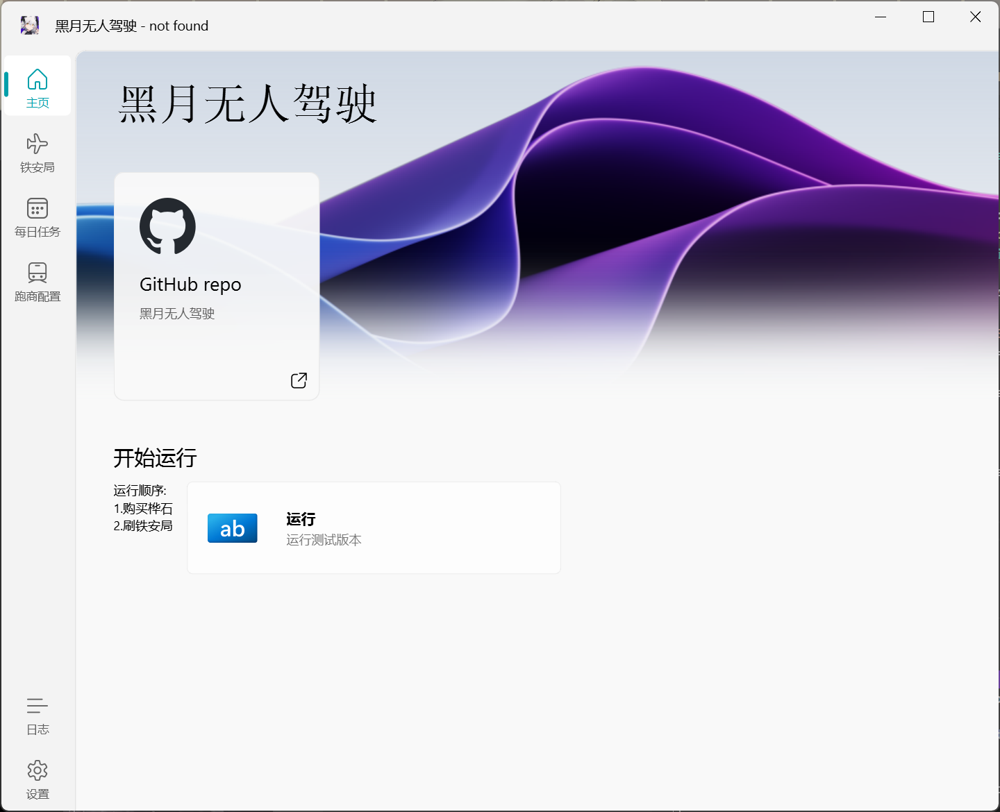
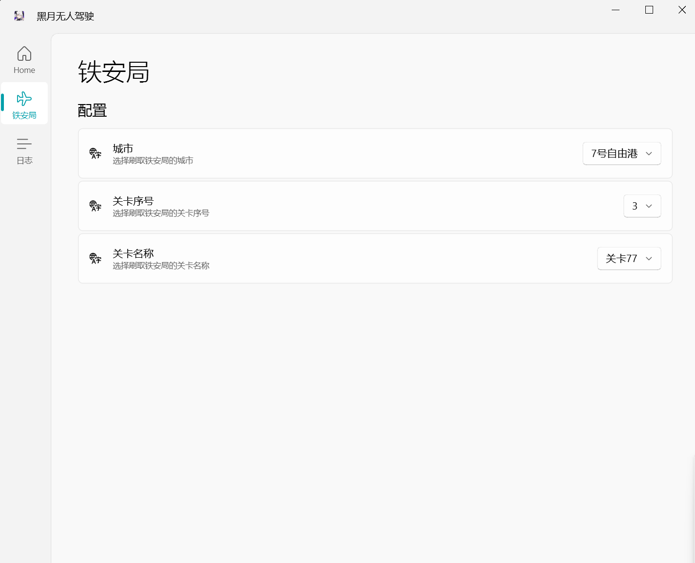

<!--
 * @Author: Night-stars-1 nujj1042633805@gmail.com
 * @Date: 2024-03-20 22:24:35
 * @LastEditTime: 2024-05-28 21:25:06
 * @LastEditors: Night-stars-1 nujj1042633805@gmail.com
-->
# <雷索纳斯>自动跑图 - 黑月无人驾驶

>黑月锁链的最新科技，街头传闻已经出现部分商品，黑月锁链正在招募测试人员
>传说中搭载该装置的列车可以让列车长离开驾驶位时安全行车

交流群: 779434493 

> [!WARNING]
> 该程序目前处于测试阶段

## 界面截图

## 使用方法
> [!TIP]
> 推荐使用**MUMU模拟器**并把分辨率和画质全调最低，模拟器分辨率调整为1280:720 dpi:240
### 1. 打包程序直接运行
  - 在[releases](https://github.com/Night-stars-1/Auto_Resonance/releases/latest)下载`Auto_Resonance_xxx.zip`,如果没有就等一会儿
  - 解压在目录
  - 进入目录点击`HeiYue.exe`
### 2. 源码安装
   - 安装Python
   - 在项目根目录执行 `pip install -r requirements.txt -i https://mirrors.aliyun.com/pypi/simple/`
   - `python gui.py`

## 常见问题
- `ssl.SSLCertVerificationError: [SSL: CERTIFICATE_VERIFY_FAILED] certificate verify failed: unable to get local issuer certificate (_ssl.c:1006)`
  - 如果你使用了新版火绒（≥6.0），请在设置-病毒防护-web扫描中添加本程序为受信任程序，或关闭加密链接扫描功能。

## 问题反馈/功能请求
- 前往[issues](https://github.com/Night-stars-1/Auto_Resonance/issues)提交反馈或者需求

## 开发指南
- 施工中
